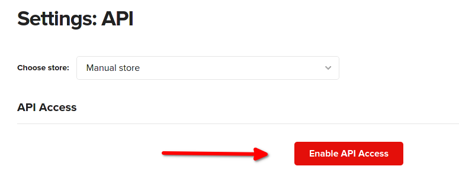

# Printful - Shopware - Product - Sync
The tool is used to synchronize products from a Printful store into a Shopware 6 shop.

### What it does and what it doesn't do
#### New creation:
- One-time transfer of the prices stored in Printful.
- Creation of variant options (size and color).
- Transfer of images for a product and its variants.
- Transfer of the title for the product.
- No categories are created.
- No description will be created.
- No "Visibility" is created in sales channels.

#### Update:
- New variants are added to the product.
- Deleted variants in Printful are also deleted in Shopware.
- New variant options (size/color) are created.
- Title, prices and images are not adjusted.
- If the product is completely deleted in Printful, the product remains untouched in Shopware.

### Prerequisites
- Java 14 JRE or JDK
- Tested with Shopware 6.4.3.0

### Create application.properties
Go to /src/resources.
There is already a sample file (application.properties-example) available. Please 
copy it to application.properties. Adjust the configuration to your needs.

### Printful preparation
1. Create a "manual store" in your printful account.
2. Enable API Access for your new manual store (Settings->Store->API):

3. add the API key to your application.properties (sync.printful.apiKey)
4. add products to your manual store.

### Shopware preparation
1. Go to Properties->System->Integration
2. Create a new integration (name: printful, administrator: on) and add id and secret to your application.properties